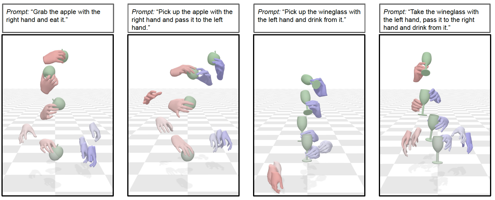

# DiffH2O: Diffusion-Based Synthesis of Hand-Object Interactions from Textual Descriptions

## [Paper](https://arxiv.org/abs/2305.12577) | [Video](https://www.youtube.com/watch?v=ed38EqN6EhU) | [Project Page](https://diffh2o.github.io/)


The official implementation of the paper [**"DiffH2O: Diffusion-Based Synthesis of Hand-Object Interactions from Textual Descriptions"**](https://arxiv.org/abs/2403.17827).




#### Bibtex
If you use this code in your research, please cite:

```
@inproceedings{christen2024diffh2o,
  title     = {DiffH2O: Diffusion-Based Synthesis of Hand-Object Interactions from Textual Descriptions},
  author    = {Christen, Sammy and Hampali, Shreyas and Sener, Fadime and Remelli, Edoardo and Hodan, Tomas and Sauer, Eric and Ma, Shugao and Tekin, Bugra},
  booktitle = {SIGGRAPH Asia 2024 Conference Papers},
  year      = {2024}
}
```

## News

📢 **7/July/25** - First release.

## Getting started

This code was tested on `Ubuntu 22.04 LTS` and requires:

* Python 3.8
* conda3 or miniconda3
* CUDA capable GPU (one is enough)


### 1. Setup environment

Install ffmpeg (if not already installed):

```shell
sudo apt update
sudo apt install ffmpeg
```
For windows use [this](https://www.geeksforgeeks.org/how-to-install-ffmpeg-on-windows/) instead.


### 2. Install dependencies

DiffH2O shares a large part of its base dependencies with the [GMD](https://github.com/korrawe/guided-motion-diffusion). However, you might find it easier to install our dependencies from scratch due to some key version differences.

Setup conda env:

```shell
conda config --append channels conda-forge
conda env create -f environment_diffh2o.yml
conda activate diffh2o
pip install -r requirements.txt
conda remove --force ffmpeg
pip install git+https://github.com/openai/CLIP.git
```

### 3. Download data

Download the data using the following script:

```bash
bash prepare/download_representations.sh
```

### 4. Download pretrained models

Download the pretrained models using the following script:

```bash
bash prepare/download_pretrained_models.sh
```

### 5. Download GRAB models

Download the object and subject models from [**GRAB**](https://grab.is.tue.mpg.de/) and place them within the assets folder as follows:

```
diffh2o                
   ├── assets
   │     ├── contact_meshes
   │     ├── female
   │     └── male
   └── ...
```

### 6. Install aitviewer

We use [aitviewer](https://eth-ait.github.io/aitviewer/) for visualization purposes.
To install the aitviewer, the following folder structure is recommended:

```
parent_folder
  ├── diffh2o                # This repository
  |     └── ...
  ├── aitviewer              # Visualization tool
  │     └── ...
  └── data                   # Data folder
        └── smplx             
              └── mano         
                   ├── MANO_LEFT.pkl
                   └── MANO_RIGHT.pkl
```

If the data is stored elsewhere, change smplx path in the `aitvconfig.yaml` of aitviewer.

To install aitviewer, carry out the following steps from the parent_folder:

```bash
git clone git@github.com:eth-ait/aitviewer.git
cd aitviewer
pip install -e .
```

Next, you need to download the MANO models from the [official page](https://mano.is.tue.mpg.de/download.php) and correctly place them according to the folder structure above.


See [aitviewer instructions](https://eth-ait.github.io/aitviewer/parametric_human_models/supported_models.html) for more information.

## Annotations GRAB Dataset
We provide textual annotations for the GRAB dataset, which can be found in this file [grab_annotations.csv](./dataset/grab_annotations.csv). There are some minor changes to the GRAB naming ("pick_all" in ours is "lift" in GRAB).

## Motion Synthesis

### Generate from test set prompts

Run our full basic model (single stage without guidance) on the simple annotations with:
```shell
python -m sample.generate --model_path ./save/diffh2o_full/model000200000.pt --num_samples 16 
```

Run our full basic model (single stage without guidance) on the detailed annotations with:
```shell
python -m sample.generate --model_path ./save/diffh2o_full_detailed/model000200000.pt --num_samples 16  --text_detailed
```

To run the two-stage model with guidance on the simple annotations, run:
```shell
python -m sample.generate_2stage --model_path ./save/diffh2o_full/model000200000.pt --num_samples 16 --guidance 
```

To run the two-stage model with guidance on the detailed annotations, run:
```shell
python -m sample.generate_2stage --model_path ./save/diffh2o_full_detailed/model000200000.pt --num_samples 16 --guidance --text_detailed
```

**You may also define:**
* `--device` id.
* `--seed` to sample different prompts.
* `--num_samples` the number of samples to generate
* `--physics_metrics` flag to evaluate physics based metrics
* `--eval_entire_set` flag to evaluate the entire set of test prompts
* `--text_detailed` flag to use the detailed annotations for evaluation

</details>

## Visualization:
For the visualizations in the paper, we utilize [**aitviewer**](https://eth-ait.github.io/aitviewer/).

To visualize generated outputs of our model, the following prompt can be used
```shell
python visualize/visualize_sequences.py --file_path save/diffh2o_full/samples_000400000/ --is_pca
```

**You may also define:**
* `--is_pca` true if PCA representation is used for MANO.
* `--pre_grasp` true for only visualizing the grasping phase.
* `--kf_vis` true to visualize grasp reference frames (if available).
* `--vis_gt` to visualize ground truth sequences from data.
* `--save_video` saving the videos to local storage instead of interactive visualization
* `--num_reps` the number of repetitions generated for each prompt
* `--range_min` the index of the first sequence to be visualized
* `--range_max` the index of the last sequence to be visualized
* `--resolution` the resolution of the visualization. Either 'high', 'medium', or 'low'

## Training DiffH2O

DiffH2O is trained on the [**GRAB**](https://grab.is.tue.mpg.de/) dataset.
### Grasp Model
To train the grasp model, run the following command:
```shell
python -m train.train_grasp
```

### Full Model
We can train two variants of our full interaction model (used with inpainting of the grasping phase).

To train on simple text descriptions, run the following command:
```shell
python -m train.train_diffh2o
```

To train on our detailed text descriptions, run the following command:
```shell
python -m train.train_diffh2o_detailed
```

### Interaction-Only Model

The model used for comparing to IMoS that only models the interaction phase (without impainting) can be trained via:
```shell
python -m train.train_interaction
```

The training options for the different configs can be found in `./configs/card.py`.

Additionally, the following can be added to all training commands:
* Use `--device` to define GPU id.
* Add `--train_platform_type {ClearmlPlatform, TensorboardPlatform}` to track results with either [ClearML](https://clear.ml/) or [Tensorboard](https://www.tensorflow.org/tensorboard).


## Acknowledgments

We build our codebase upon previous works. We want to thank the following researchers for their contributions and code:

[GMD](https://github.com/korrawe/guided-motion-diffusion), [GRAB](https://github.com/otaheri/GRAB), [MDM](https://github.com/GuyTevet/motion-diffusion-model), [guided-diffusion](https://github.com/openai/guided-diffusion), [MotionCLIP](https://github.com/GuyTevet/MotionCLIP), [text-to-motion](https://github.com/EricGuo5513/text-to-motion), [actor](https://github.com/Mathux/ACTOR), [joints2smpl](https://github.com/wangsen1312/joints2smpl), [MoDi](https://github.com/sigal-raab/MoDi).

## License
This code is distributed under an [CC-BY-NC LICENSE](LICENSE).

Note that our code depends on other libraries, including CLIP, MANO, SMPL-X, PyTorch3D, and uses datasets that each have their own respective licenses that must also be followed.
